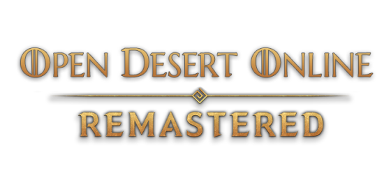

<div align="center">
  

  # ODO Launcher

  **Лаунчер и патчер для игры Black Desert Online (приватный сервер Open Desert Online)**

  [](https://dotnet.microsoft.com/)
  [](https://docs.microsoft.com/en-us/dotnet/csharp/)
  [](https://mahapps.com/)
  [](https://www.microsoft.com/windows)
</div>

---

## 📋 О проекте

**ODO Launcher** — это Windows-приложение для автоматического обновления и запуска игрового клиента *Black Desert Online* на приватном сервере **Open Desert Online**. Лаунчер скачивает патчи, обновляет себя и запускает игру с вашими учётными данными.

---

## ✨ Возможности

- 🔐 **Авторизация** — вход по логину и паролю с возможностью сохранения данных (зашифрованное хранение)
- 🔄 **Автообновление лаунчера** — при выходе новой версии лаунчер обновляется сам
- 📦 **Система патчей** — автоматическая загрузка только новых патчей игрового клиента
- ⏸️ **Возобновление загрузки** — прерванная загрузка продолжается с того места, где остановилась
- 📊 **Прогресс загрузки** — отображение скорости (МБ/с), текущего и общего прогресса
- 🚀 **Запуск игры** — передача учётных данных клиенту `BlackDesert64.exe` автоматически
- 🔒 **Защита от дублирования** — запрет запуска нескольких копий лаунчера одновременно

---

## 🖥️ Скриншот

> Приложение использует тему **MahApps.Metro Dark Steel** для современного внешнего вида.

---

## 🏗️ Архитектура

Проект построен по паттерну **MVVM** (Model-View-ViewModel):

```
ODOLauncher/
├── Models/
│   ├── Encrypt.cs              # Шифрование паролей (Triple-DES + MD5)
│   ├── Updater.cs              # Логика обновления патчей и лаунчера
│   ├── Downloader/             # HTTP/FTP загрузчик с поддержкой возобновления
│   └── Settings/
│       ├── LocalConfig.cs      # Локальная конфигурация (odol.config)
│       └── RemoteConfig.cs     # Удалённая конфигурация (URLs, версии)
├── ViewModels/
│   └── MainViewModel.cs        # Основная логика UI (MVVM)
└── Views/
    └── MainWindow.xaml         # Интерфейс приложения
```

---

## ⚙️ Технологии

| Компонент | Технология |
|-----------|-----------|
| Язык | C# 8.0 |
| Фреймворк | .NET Framework 4.8 |
| UI | WPF + MahApps.Metro 2.2 |
| Паттерн | MVVM |
| Конфигурация | SharpConfig (INI-формат) |
| Деплой | Costura.Fody (один .exe без зависимостей) |

---

## 🔧 Сборка

### Требования

- [Visual Studio 2019+](https://visualstudio.microsoft.com/) с установленным компонентом **.NET Framework 4.8**
- NuGet Package Manager (встроен в Visual Studio)

### Шаги сборки

1. Клонируйте репозиторий:
   ```bash
   git clone https://github.com/VaderTi/ODOLauncher.git
   cd ODOLauncher
   ```

2. Откройте `ODOLauncher.sln` в Visual Studio

3. Соберите проект:
   - **Меню Build → Rebuild Solution**
   - Или нажмите `Ctrl + Shift + B`

4. Готовый исполняемый файл будет находиться в:
   ```
   ODOLauncher\bin\Release\ODO Launcher.exe
   ```

> **Примечание:** Благодаря Costura.Fody, результирующий `.exe` является самодостаточным — все зависимости встроены в него.

---

## 🚀 Использование

1. Запустите `ODO Launcher.exe`
2. Введите логин и пароль от вашего аккаунта на сервере
3. Нажмите **«Обновить»** — лаунчер скачает актуальные патчи
4. После завершения обновления нажмите **«Играть»**

Данные для входа могут быть сохранены — для этого включите опцию **«Запомнить»**.

---

## 📄 Конфигурационный файл

При первом запуске в директории с лаунчером создаётся файл `odol.config`:

```ini
[ODOL]
LastPatchId = 0
Login = <зашифрованный логин>
Password = <зашифрованный пароль>
Save = false
```

---

## 📝 Лицензия

Copyright © 2020 **Open Desert Online**. Все права защищены.
